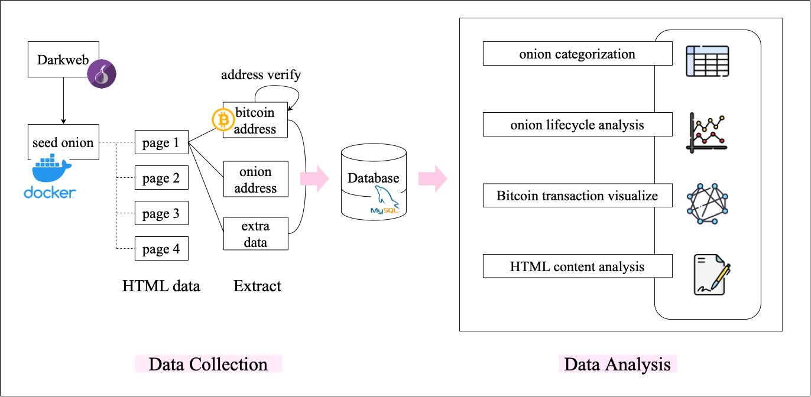

# TorCollector

### 주어진 seed onion 마다 순회하며 모든 페이지를 수집하는 tor crawler 프로그램  

#### 실행 방법
~~~
python3 page_traverse.py onion.txt
~~~

#### 후속 프로젝트
- 멀티 프로세싱 상에서 logging 추가  
- html content를 분석하여 onion category 자동 분류  
- Mongodb 연결  

